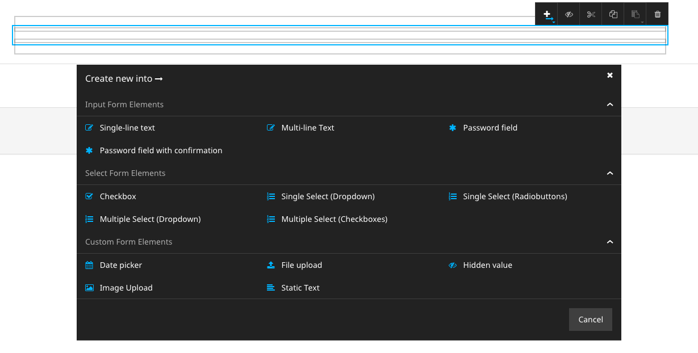
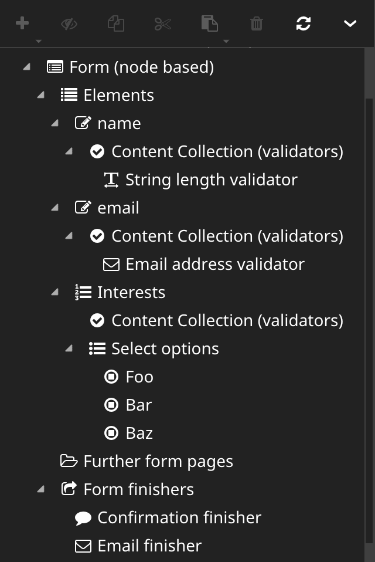
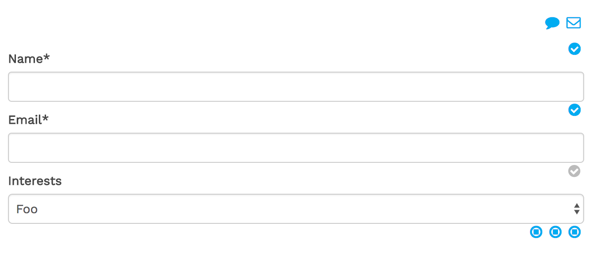

# Flow Form Framework integration into Neos CMS

This package adds a builder for the [Flow Form Framework](https://github.com/neos/form)
to the [Neos CMS](https://neos.io) backend.
It also comes with [Fusion](https://neos.readthedocs.io/en/stable/CreatingASite/Fusion/index.html)
prototypes that allow for dynamic Fusion based Form definitions.

## Usage

Install this package using GIT:

```
git clone https://github.com/bwaidelich/form-builder.git Packages/Application/Neos.Form.Builder
```

And make sure to rescan the installed packages so that it is properly installed:

```
./flow flow:package:rescan
```

**Note:** This package requires the `neos/neos` package in version 3.1 or higher

In the Neos backend there's now a new Content Element type that can be
used:


**Note:** If you have the `Neos.NodeTypes` package installed, there are two types of Forms that
can be inserted. The following snippet can be added to the sites `NodeTypes.yaml` in order
to disable the Neos.NodeTypes Form:
```yaml
'Neos.NodeTypes:Form': ~
```

Now, *Form Elements* can be added to the Form:



To each Form Element *Validators* can be added and some elements allow to create child Form Elements or
*Select Options*.
Besides, every form allows to create *Further Form Pages* that can contain elements themselves.
And, of course, *Form Finishers* can be added to the Form.

So there are quite a lot of Content Collections and they are easily confused.
One solution is to use the *Structure Tree* when working on complex forms:



In addition this package comes with some custom StyleSheet that should make
the Form Builder more accessible:

## Adjust appearance of the Form Builder

This package provides some CSS that can be included in order to adjust the
styling of the Form Builder within the Neos Backend.
Considering the `Neos.Neos:Page` Fusion object is defined as `page`, the
following Fusion snippet can be added in order to include the custom CSS
when in the Neos Backend:

```fusion
page.head.formBuilderStyles = Neos.Fusion:Tag {
    tagName = 'link'
    attributes {
        rel = 'stylesheet'
        href = Neos.Fusion:ResourceUri {
            path = 'resource://Neos.Form.Builder/Public/Styles/Backend.css'
        }
    }
    @position = 'end'
    @if.isInBackend = ${documentNode.context.inBackend}
}
```

(Note: There's also a version for the "new" Neos UI, but it's not yet supported)

As a result the form will look something like this in the Backend:



## Build forms with Fusion

The main purpose of this package is its integration to the Neos Backend, using
Content Repository Nodes to represent the definition of a Form.
But in some cases it can be very useful to define Forms in pure Fusion:

```fusion
prototype(Some.Package:ContactForm) < prototype(Neos.Form.Builder:Form) {
    presetName = 'bootstrap'
    firstPage {
        elements {
            name = Neos.Form.Builder:SingleLineText {
                label = 'Name'
                validators {
                    stringLength = Neos.Form.Builder:StringLengthValidator {
                        options.minimum = 5
                    }
                }
                properties.placeholder = 'Your name'
            }
            email = Neos.Form.Builder:SingleLineText {
                label = 'Email'
                validators {
                    emailAddress = Neos.Form.Builder:EmailAddressValidator
                }
                properties.placeholder = 'Your email address'
            }
            interests = Neos.Form.Builder:MultipleSelectCheckboxes {
                label = 'Interests'
                required = ${false}
                properties.options {
                    neos = 'Neos CMS'
                    flow = 'Neos Flow'
                    chicken = 'Chickens'
                }
            }
            comment = Neos.Form.Builder:MultiLineText {
                label = 'Message'
                properties.placeholder = 'Your Comment'
            }
        }
    }
    finishers {
        confirmationFinisher = Neos.Form.Builder:ConfirmationFinisher {
            options {
                message = 'Thank you for your comment, {name}!'
            }
        }
    }
}
```

Now the `Some.Package:ContactForm` prototype can be used just like any other
Content Element (or even as Document).

In this case the result is just a static contact Form, so there is not much
difference to YAML-based Form Definitions.
But obviously use all the Fusion and Eel power can be used to create dynamic forms.
For example Form fields could be pre-filled with the authenticated user's data:

```fusion
// ...
    someFormField = Neos.Form.Builder:SingleLineText {
        defaultValue = ${Security.account.accountIdentifier}
        // ...
```

## Caching

By default, all `Neos.Form.Builder:Form` implementations are *not cached*.
This is done in order to avoid nasty bugs when assumed otherwise.

To optimize performance, this behavior can be changed for individual forms
to make them (partially) cached.
I.e. the static form above could be changed as follows:

```fusion
prototype(Some.Package:ContactForm) < prototype(Neos.Form.Builder:Form) {
    @cache {
        mode = 'dynamic'
        entryIdentifier {
            node = ${node}
        }
        entryDiscriminator = ${request.httpRequest.methodSafe ? 'static' : false}
        context {
            1 = 'node'
            2 = 'documentNode'
        }
    }
    // ...
```

With that in place, the initial Form rendering is cached and the mode is
changed to "uncached" when the Form is submitted (= unsafe request).

**Note:** The `dynamic` Cache mode only works reliably with Neos versions 2.3.15+ and 3.1.5+